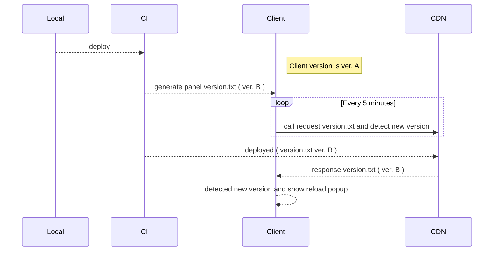

# 測試文章

```javascript showLineNumbers

 // highlight-next-line
console.log('test docs with highlight')

console.log('test docs')

```

:::note

Some **content** with _Markdown_ `syntax`. Check [this `api`](#).

:::


