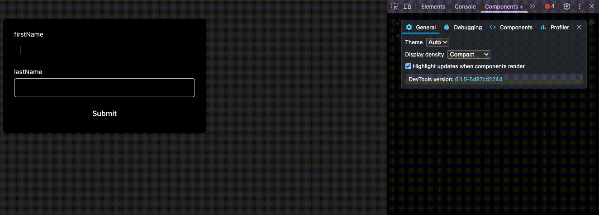
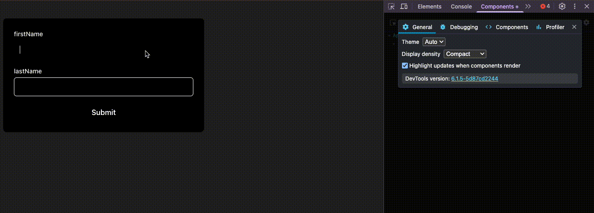
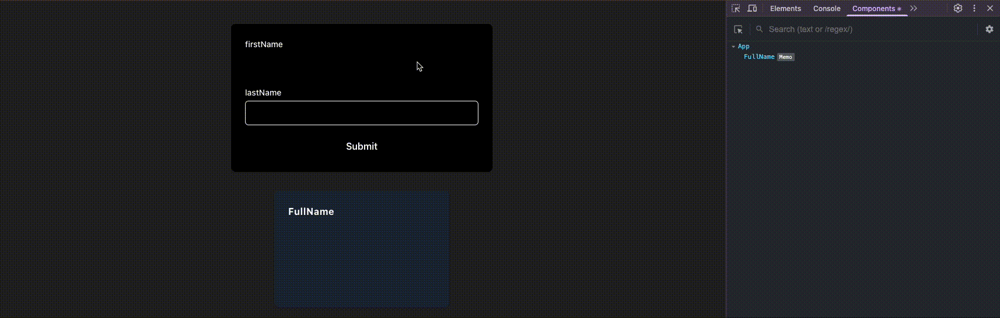

# React Hook Form

React Hook Form 是一個在 React 當中處理表單狀態的函式庫，宗旨在於使用 Uncontrolled Form 改善在處理表單上的效能，可以由[官方問答](https://react-hook-form.com/faqs)中得知這件事情。

> Performance is one of the primary reasons why this library was created. React Hook Form relies on an uncontrolled form, which is the reason why the register function captures ref and the controlled component has its re-rendering scope with Controller or useController. This approach reduces the amount of re-rendering that occurs due to a user typing in an input or other form values changing at the root of your form or applications. Components mount to the page faster than controlled components because they have less overhead. As a reference, there is a quick comparison test that you can refer to at this repo [link](https://github.com/react-hook-form/performance-compare).


因此在使用上盡可能優先使用 Uncontrolled 寫法取代 Controlled 寫法。

## 核心寫法整理

### Uncontrolled Component: `register`

這是最基本且效能最好的方式。透過 `register` API，React Hook Form 可以直接操作 DOM 元素，避免不必要的組件渲染。

```typescript showLineNumbers
import { useForm } from "react-hook-form";

type FormValues = {
  firstName: string;
  lastName: string;
};

function App() {
  const form = useForm<FormValues>({
    defaultValues: {
      firstName: "",
      lastName: "",
    },
  });

  function onSubmit(data: FormValues) {
    console.log(data);
  }

  return (
    <div>
      <form onSubmit={form.handleSubmit(onSubmit)}>
        <div>
          <label htmlFor="firstName">firstName</label>
          <input id="firstName" type="text" {...form.register("firstName")} />
        </div>
        <div>
          <label htmlFor="lastName">lastName</label>
          <input id="lastName" type="text" {...form.register("lastName")} />
        </div>
        <button type="submit">Submit</button>
      </form>
    </div>
  );
}

export default App;
```

### Controlled Component: `Controller`

當你需要與外部受控組件（例如：Ant Design, Material-UI 的元件）整合時，`Controller` 就派上用場。它作為一個包裝器，將 React Hook Form 的狀態與這些 UI 元件連接起來。

```typescript
import { Controller, useForm } from "react-hook-form";

type FormValues = {
  firstName: string;
  lastName: string;
};

function App() {
  const form = useForm<FormValues>({
    defaultValues: {
      firstName: "",
      lastName: "",
    },
  });

  function onSubmit(data: FormValues) {
    console.log(data);
  }

  return (
    <div>
      <form onSubmit={form.handleSubmit(onSubmit)}>
        <Controller
          name="firstName"
          control={form.control}
          render={({ field }) => {
            return (
              <div>
                <label htmlFor="firstName">firstName</label>
                <input id="firstName" type="text" {...field} />
              </div>
            );
          }}
        />
        <Controller
          name="lastName"
          control={form.control}
          render={({ field }) => {
            return (
              <div>
                <label htmlFor="lastName">lastName</label>
                <input id="lastName" type="text" {...field} />
              </div>
            );
          }}
        />
        <button type="submit">Submit</button>
      </form>
    </div>
  );
}

export default App;
```

### 效能比較

Uncontrolled Form (`register`) 在使用者輸入時不會觸發組件的重新渲染，而 Controlled Form (`Controller`) 則會在每次輸入時都重新渲染。這也是為什麼官方推薦優先使用 `register` 的原因。

:::info
你可以透過 React Developer Tools，進入 Components 分頁，點選右上角的齒輪（View settings），在 General 頁籤中勾選「Highlight updates when components render」來觀察元件重新渲染的情況。
:::



<div style={{ textAlign: "center", fontSize: "0.95em", color: "#666" }}>
  圖：Uncontrolled Form 範例，使用 `register` 註冊欄位，輸入時組件不會重新渲染。
</div>



<div style={{
  textAlign: "center",
  fontSize: "0.95em",
  color: "#666"
}}>
  圖：Controlled Form 範例，使用 `Controller` 控制欄位，每次輸入都會觸發組件重新渲染。
</div>

## 進階應用

### 監聽欄位變化：`watch` / `useWatch`

當你需要根據某個欄位的值來決定其他操作（例如：顯示/隱藏另一個欄位）時，可以使用 `watch` 或 `useWatch`。

如果不想因為監聽而造成高頻率的渲染，可以結合 `debounce` 和 `React.memo` 來優化效能，只在使用者停止輸入一段時間後才更新衍生狀態（Derived State）。

```typescript
import React, { useEffect, useState } from "react";
import { useForm, useWatch } from "react-hook-form";

type FormValues = {
  firstName: string;
  lastName: string;
};

function useDebounceValue<T>(value: T, delay: number): T {
  const [debouncedValue, setDebouncedValue] = useState(value);

  useEffect(() => {
    const handler = setTimeout(() => {
      setDebouncedValue(value);
    }, delay);

    return () => {
      clearTimeout(handler);
    };
  }, [value, delay]);

  return debouncedValue;
}

const FullName = React.memo(function FullName({ fullName }: { fullName: string }) {
  return (
    <div className="derived-section">
      <div>FullName (Debounced)</div>
      <div>{fullName}</div>
    </div>
  );
});


function App() {
  const form = useForm<FormValues>({
    defaultValues: {
      firstName: "",
      lastName: "",
    },
  });

  function onSubmit(data: FormValues) {
    console.log(data);
  }

  const [firstName, lastName] = useWatch({
    control: form.control,
    name: ["firstName", "lastName"],
  });

  const debouncedFullName = useDebounceValue(`${firstName} ${lastName}`, 500);

  return (
    <div>
      <form onSubmit={form.handleSubmit(onSubmit)}>
        <div>
          <label htmlFor="firstName">firstName</label>
          <input id="firstName" type="text" {...form.register("firstName")} />
        </div>
        <div>
          <label htmlFor="lastName">lastName</label>
          <input id="lastName" type="text" {...form.register("lastName")} />
        </div>
        <button type="submit">Submit</button>
      </form>
      <FullName fullName={debouncedFullName} />
    </div>
  );
}

export default App;
```


<div style={{ textAlign: "center", fontSize: "0.95em", color: "#666" }}>
  圖：結合 `useWatch` 和 `debounce`，優化衍生狀態的顯示。
</div>

### 表單驗證

React Hook Form 提供了強大的內建驗證功能。你可以在 `register` 的第二個參數中傳入驗證規則。

```typescript showLineNumbers
import { useForm, SubmitHandler } from "react-hook-form";

type FormValues = {
  name: string;
  email: string;
};

function ValidationForm() {
  const { register, handleSubmit, formState: { errors } } = useForm<FormValues>();

  const onSubmit: SubmitHandler<FormValues> = data => console.log(data);

  return (
    <form onSubmit={handleSubmit(onSubmit)}>
      <div>
        <label htmlFor="name">Name</label>
        <input
          id="name"
          {...register("name", { 
            required: "名字是必填的", 
            minLength: { value: 2, message: "名字長度至少要 2 個字" } 
          })}
        />
        {errors.name && <p style={{ color: 'red' }}>{errors.name.message}</p>}
      </div>

      <div>
        <label htmlFor="email">Email</label>
        <input
          id="email"
          {...register("email", {
            required: "Email 是必填的",
            pattern: {
              value: /^\S+@\S+$/i,
              message: "請輸入有效的 Email 格式"
            }
          })}
        />
        {errors.email && <p style={{ color: 'red' }}>{errors.email.message}</p>}
      </div>
      
      <button type="submit">Submit</button>
    </form>
  );
}
```
- `formState: { errors }`: 從 `useForm` 回傳的物件中可以取得 `errors` 物件，裡面包含了所有欄位的驗證錯誤訊息。
- `register("fieldName", { ...validationRules })`:
  - `required`: 欄位是否必填。
  - `minLength`, `maxLength`: 字串長度的最小與最大值。
  - `pattern`: 使用正規表示式進行驗證。
  - `validate`: 自定義驗證邏輯。
