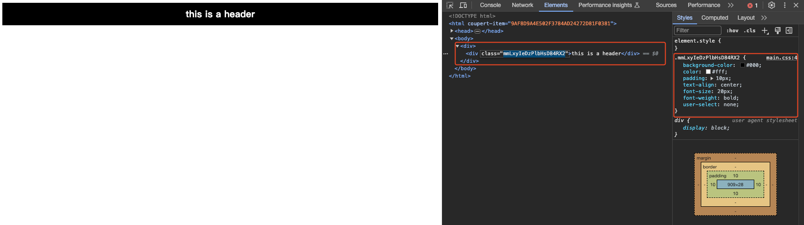
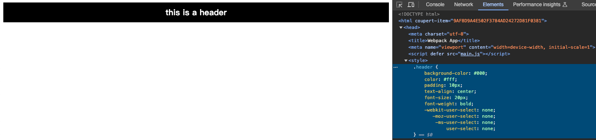
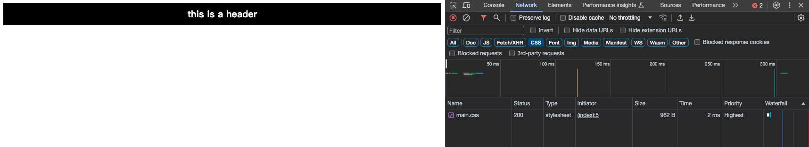

本文將會介紹 webpack 中的 loaders 與 plugins，這些是 webpack 中不可或缺的重要元件。loaders 負責轉換各種類型的檔案，而 plugins 則用於執行更廣泛的打包任務。

雖說目前市面上的 bundler 已經更為多元，並且甚至有許多 bundler 已經逐漸取代 webpack 成為主流，但 webpack 仍然是最為廣泛使用的 bundler 之一。


## Loaders

webpack 只能處理 javascript 與 json 檔案，如果需要讓 webpack 處理其他類型的檔案，就需要使用與那類型檔案相對應的 loader 來處理。

### css-loader

如 css 檔案就需要使用 css-loader 來處理，
這樣 webpack 才能正確的將 css 檔案打包進 bundle 中。

需要先於 webpack.config.js 設置 css-loader。

```js title="webpack.config.js" showLineNumbers
{
    test: /\.css$/,
    use: ['css-loader'],
},
```

然後在 js 中引入 css 檔案才能順利被 webpack 處理並且打包

```js title="main.js" showLineNumbers
import './style.css';
```

如果沒有設置 css-loader，
則會出現類似以下錯誤，
意思是 webpack 在告訴我們，他看不懂 css 檔案，
請尋找合適的 loader 來處理 css 檔案。

```js title="error" showLineNumbers
ERROR in ./src/base.css 1:0
Module parse failed: Unexpected token (1:0)
You may need an appropriate loader to handle this file type, currently no loaders are configured to process this file. See https://webpack.js.org/concepts#loaders
> .header {
|     background-color: #000;
|     color: #fff;
@ ./src/index.js 3:0-20

webpack 5.89.0 compiled with 1 error in 395 ms
```

#### css module

如果想要開啟 css module 功能，
可以在 css-loader options 中設置 modules 為 true，
就可以開啟 css module 功能，
並且記得將 css 檔案跟 css-loader 的 test 規則改為慣例的後綴 `*.module.css`。

```js {5} title="webpack.config.js" showLineNumbers
{
    test: /\.module.css$/,
    use: ['css-loader'],
    options: {
        modules: true,
    },
},
```

:::info
這裡會說是慣例的原因，
是因為 css-loader 並不會強制，只能使用 .module.css 作為 css 檔案的後綴，
完全取決於上述設定的 `test` 規則，
但大多數專案會以 .module 來識別 css module 的檔案。
:::

```css title="base.module.css" showLineNumbers
.header {
    background-color: #000;
    color: #fff;
    padding: 10px;
    text-align: center;
    font-size: 20px;
    font-weight: bold;
    user-select: none;
}
```

這樣就可以在 js 中使用 css module 的方式引入 css 檔案

```js {1,6} title="main.js" showLineNumbers
import styles from './base.module.css';

const root = document.createElement('div');

const header = document.createElement('div');
header.className = styles.header;
header.innerHTML = 'this is a header';

root.appendChild(header);
document.body.appendChild(root);
```

```js {2} title="webpack.config.js" showLineNumbers
{
    test: /\.module.css$/,
    use: ['css-loader'],
    options: {
        modules: true,
    },
},
```

就可以看見 css module 的效果，
會為你的 css class 建立出 unique 的名稱，
避免 css pollution 的問題。



###### localIdentName

如果認為 css module 產生出來的名稱在開發時不易閱讀，
可以在 css-loader options 中設置 localIdentName 來自訂名稱，
但通常建議只使用於開發時，
於 production 時還是可以使用預設的名稱或是不帶有意義的名稱，
來避免給予爬蟲有用的資訊。

```js {6} title="webpack.config.js" showLineNumbers
{
    test: /\.module.css$/,
    use: ['css-loader'],
    options: {
        modules: {
            localIdentName: '[path][name]__[local]--[hash:base64:5]',
        },
    },
},
```

### style-loader

css-loader 的主要功能是將 css 檔案轉換成 JavaScript 模組並打包進 bundle 中，
但它並不具備將樣式實際應用到網頁的功能。
為了讓樣式能夠真正生效，我們需要搭配 style-loader 來將這些 css 內容注入到網頁的 DOM 結構中。

```css title="base.css" showLineNumbers
.header {
    background-color: #000;
    color: #fff;
    padding: 10px;
    text-align: center;
    font-size: 20px;
    font-weight: bold;
    user-select: none;
}
```

```js title='main.js' showLineNumbers
import './base.css';

const root = document.createElement('div');

const header = document.createElement('div');
header.className = 'header';
header.innerHTML = 'this is a header';

root.appendChild(header);
document.body.appendChild(root);
```

並且會有一份 html 檔案，
用來呈現最終網頁渲染出來的結果。

```html title="index.html" showLineNumbers
<!doctype html>
<html>
    <head>
        <meta charset="utf-8" />
        <title>Webpack App</title>
        <meta name="viewport" content="width=device-width, initial-scale=1" />
        <script defer src="main.js"></script>
    </head>
    <body></body>
</html>
```

到此我們會認為我們於 base.css 所撰寫的樣式，
應該會正常的顯示在 header 元素上，
但是實際上並不會如此。
因為尚未使用 style-loader 將 css 檔案載入到網頁中，
所以 css 樣式並不會生效。


這是因為 css-loader 只是將 css 檔案打包進 bundle 中，
但是並不會將 css 內容真正的載入到網頁中，
所以還需要使用 style-loader 來將 css 檔案載入到網頁中。
它實際上作為是將我們所撰寫的 css 放入 style tag 當中，
並且將 style tag 放入 head tag 中。

```js title="webpack.config.js" showLineNumbers
{
    test: /\.css$/,
    use: ['style-loader', 'css-loader'],
},
```

:::info
請注意 webpack loader 的執行順序性，
webpack loader 會由後往前依序執行，
因此必須先透過 css-loader 將 css 檔案打包進 js 檔案中，
再由 style-loader 將打包好的 css 內容載入到網頁中。
這就是為什麼在設定檔中，style-loader 要放在 css-loader 前面的原因。
:::

當我們重新執行 webpack 並重新整理網頁後，
可以看到先前撰寫的 CSS 樣式已完美地套用在 header 元素上。
透過瀏覽器的開發者工具，我們也能清楚地看到 style 標籤已被正確地插入到 head 標籤中，
這證明了 style-loader 確實成功地將 CSS 內容注入到了網頁的 DOM 結構中。



### mini-css-extract-plugin

在實際的專案開發中，我們通常會希望將 CSS 檔案獨立出來，而不是將其打包進 JavaScript 檔案中。這樣做不僅可以讓檔案結構更加清晰，還能夠更有效地利用瀏覽器的快取機制。為了達到這個目的，我們可以使用 mini-css-extract-plugin 這個強大的工具來將 CSS 檔案獨立抽離出來。

```js title="webpack.config.js" showLineNumbers
const MiniCssExtractPlugin = require('mini-css-extract-plugin');

module.exports = {
    module: {
        rules: [
            {
                test: /\.css$/,
                use: [MiniCssExtractPlugin.loader, 'css-loader'],
            },
        ],
    },
    plugins: [new MiniCssExtractPlugin()],
};
```

mini-css-extract-plugin 的功能與 style-loader 相似，但兩者不應同時使用。主要差異在於處理 CSS 的方式：style-loader 會將 CSS 內容注入到 HTML 的 style 標籤中，而 mini-css-extract-plugin 則會將 CSS 抽離成獨立的檔案，並透過 link 標籤引入到網頁中。這種方式不僅可以讓檔案結構更加清晰，還能更有效地利用瀏覽器的快取機制。

```html {8} title="index.html" showLineNumbers
<!doctype html>
<html>
    <head>
        <meta charset="utf-8" />
        <title>Webpack App</title>
        <meta name="viewport" content="width=device-width, initial-scale=1" />
        <script defer src="main.js"></script>
        <link href="main.css" rel="stylesheet" />
    </head>
    <body></body>
</html>
```

從瀏覽器開發者工具中可以觀察到，CSS 檔案已經成功地被獨立抽離出來。在 Network 中，我們能清楚地看到 main.css 作為一個獨立的檔案被載入，這證明了 mini-css-extract-plugin 確實有效地將樣式內容從 JavaScript bundle 中分離出來。



### postcss-loader

postcss-loader 是一個用於處理 CSS 的 Webpack loader。它允許你使用 PostCSS 來擴充或向前兼容 CSS 語法，以便在不同瀏覽器中都能正常顯示。

#### postcss-preset-env

postcss-preset-env 是一個 PostCSS 的 plugin，
它允許你使用 PostCSS 來擴充或向前兼容 CSS 語法，
以便在不同瀏覽器中都能正常顯示。

##### browsers

你可以在 options 中設定 browsers 參數來指定目標瀏覽器版本。這個設定值會完全覆蓋專案中的 `.browserslist` 檔案設定。如果你沒有特別在 options 中指定 browsers，則會採用 `.browserslist` 中的預設值。

```js {7} showLineNumbers
{
    loader: 'postcss-loader',
    options: {
        postcssOptions: {
            plugins: [
                ['postcss-preset-env', {
                    browsers: 'last 2 versions',
                }],
            ],
        },
    },
},
```

#### autoprefixer

autoprefixer 的主要功能是自動為 CSS 屬性添加瀏覽器特定的前綴，以確保樣式在不同瀏覽器中都能正常運作。值得注意的是，postcss-preset-env 已經內建了 autoprefixer 的功能，因此使用 postcss-preset-env 時就不需要再額外安裝 autoprefixer。

兩者的主要差異在於功能範圍：
- postcss-preset-env 不僅包含了 autoprefixer 的前綴處理功能，還能將現代 CSS 語法轉換為較舊版本的語法，提供更全面的瀏覽器兼容性支援
- autoprefixer 則專注於處理 CSS 前綴，是一個更為單一且專門的工具

#### tailwindcss

tailwindcss 在 webpack 專案當中，也是需要透過 postcss-loader 來處理，
透過 postcss plugin 來處理 tailwindcss 的樣式。

```js {6} showLineNumbers
{
    loader: 'postcss-loader',
    options: {
        postcssOptions: {
            plugins: [
                '@tailwindcss/postcss',
                ['postcss-preset-env', {
                    browsers: 'last 2 versions',
                }],
            ],
        },
    },
},
```

### svgr-loader

@svgr/webpack 是一個專門用於將 SVG 檔案轉換成 React 元件的 loader。
透過這個 loader，我們可以將 SVG 檔案以 React 元件的形式引入並使用，
這讓 SVG 的使用變得更加靈活且符合 React 的開發模式。

```js {9} showLineNumbers
{
  test: /\.svg$/,
  use: [
    {
      loader: '@svgr/webpack',
    },
  ],
},
```

在設定好 loader 後，我們就可以在 JavaScript 檔案中引入 SVG 檔案，
並將其視為一個 React 元件來使用。

```js {12} title="main.js" showLineNumbers
import * as React from "react";
import ReactDOM from "react-dom/client";
import ReactIcon from "./assets/react-logo.svg";

const root = document.createElement("div");
document.body.appendChild(root);

function App() {
    return (
        <div>
            <h1>SVGR Loader Playground</h1>
            <ReactIcon width={100} height={100} />
        </div>
    );
}

ReactDOM.createRoot(root).render(<App />);
```


### babel-loader

babel-loader 是一個用於將 JavaScript 檔案轉換成向前兼容的 JavaScript 檔案的 loader。
它允許我們使用 Babel 來轉譯 (transpile) 我們的 JavaScript 檔案，
並且讓我們能夠使用最新的 JavaScript 語法，或是特殊的語法糖。
並且預設會使用離 webpack.config.js 最近的 babel.config.js 設定檔，
如果想要使用指定路徑的 babel.config.js 設定檔，
可以透過 options 中的 configFile 來指定。

並且若是不想額外寫 babel.config.js 設定檔，
也可以 inline 撰寫在 webpack.config.js 中。

```js {3} title="webpack.config.js (with babel.config.js)" showLineNumbers
// 需要另外撰寫 babel.config.js 設定檔
{
  test: /\.js$/,
  use: ['babel-loader'],
},
```

```js {3} title="webpack.config.js (inline)" showLineNumbers
// 不需要撰寫 babel.config.js 設定檔
{
    test: /\.js?$/,
    exclude: /node_modules/,
    use: [
        {
            loader: 'babel-loader',
            options: {
                presets: ['@babel/preset-env'],
            },
        },
    ],
},
```

:::danger
    此處要注意使用 inline 撰寫時，
    如果域中還是有 babel.config.js 設定檔，
    兩份檔案會合併 (merge) 成一份檔案，
    如果想要避免此狀況可以使用 configFile: false 來避免與外部設定檔合併。

    [The options passed here will be merged with Babel config files, e.g. babel.config.js or .babelrc.](https://webpack.js.org/loaders/babel-loader/)

    本人因為這樣掛站一次，
    所以特別在此提醒。
    無論是將 babel config 只要有搬動都要好好測試啊！
:::

#### babel-preset-env

babel-preset-env 它會根據你設定的 browserslist 來決定要轉譯哪些 JavaScript 語法，
並且讓我們能夠使用最新的 JavaScript 語法，或是特殊的語法糖，來滿足 browserslist 的目標瀏覽器。


### ts-loader

將 typescript 轉換成 javascript，
讓 webpack 能夠處理 typescript 檔案。

```js {3} title="webpack.config.js" showLineNumbers
{
    test: /\.ts$/,
    use: ['ts-loader'],
},
```


## Plugins

### html-webpack-plugin

html-webpack-plugin 是一個用於生成 HTML 檔案的 plugin。
它允許我們在 webpack 打包過程中，自動生成一個 HTML 檔案，
並且將打包好的 bundle 檔案自動插入到 HTML 檔案中。

template 參數可以指定一個 HTML 模板檔案，
webpack 會將打包好的 bundle 檔案自動插入到 HTML 檔案中。

```js title="webpack.config.js" showLineNumbers
const HtmlWebpackPlugin = require('html-webpack-plugin');

module.exports = {
    plugins: [
        new HtmlWebpackPlugin({
            template: './src/index.html',
        }),
    ],
};
```


### copy-webpack-plugin

copy-webpack-plugin 是一個用於複製檔案的 plugin。
它允許我們在 webpack 打包過程中，將指定的檔案複製到指定的目錄中。

```js title="webpack.config.js" showLineNumbers
const CopyWebpackPlugin = require('copy-webpack-plugin');

module.exports = {
    plugins: [
        new CopyWebpackPlugin({
            patterns: [{ from: 'src/assets', to: 'assets' }],
        }),
    ],
};
```

### sentry-webpack-plugin

sentry-webpack-plugin 是一個用於上傳 source map 到 Sentry 的 plugin。
它允許我們在 webpack 打包過程中，將 source map 上傳到 Sentry 中。

```js title="webpack.config.js" showLineNumbers
const SentryWebpackPlugin = require('@sentry/webpack');

module.exports = {
    plugins: [new SentryWebpackPlugin({
        org: 'your-org-name',
        project: 'your-project-name',
        authToken: process.env.SENTRY_AUTH_TOKEN,
        options: {},
    })],
};
```

