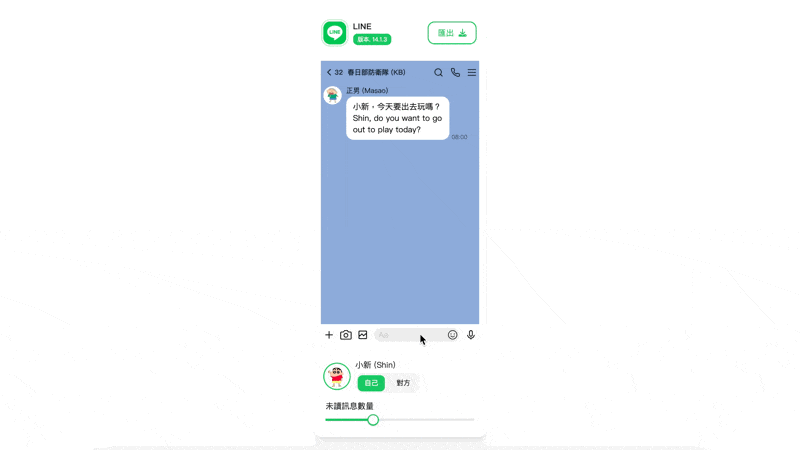

import Button from "../../src/components/Button";

# FLMG

## 介紹

FLMG ( Fake Line Message Generator ) 於 [社群丼](https://www.facebook.com/groups/677738998998606) 臉書社團看到有行銷人員對此需求，因此想說來寫個小工具，可以讓行銷人員在社群上快速生成行銷訊息，並且可以自訂要發送的訊息內容，以及要發送的對象。以便行銷人員能夠在短時間內生成能夠因應不同場合的行銷訊息。

<Button disabled onClick={() => window.open("https://flmg.guychienll.dev", "_blank")}> 前往 FLMG </Button>  

> 由於後續發現該網站會被利用於非初衷行銷之用途，因此以下架該網站，並不再提供此服務。

## 技術

該應用程式由開始到結束全部都在 Client 端完成，使用技術如下：

使用技術

- Next.js
- Next UI
- Tailwind CSS
- TypeScript
- Vercel

## 功能及使用方式

1. 編輯對象/群組名稱
   - 可以直接點擊群組名稱處，直接編輯想發送的對象/群組名稱
2. 編輯訊息內容
   - 可以直接點擊訊息內容處，直接編輯想發送的訊息內容，並且發送就如同使用通訊軟體一般。
3. 切換角色
   - 可以切換角色，可以選擇切換為發送訊息者，也可以切換為接收訊息者，並且可以更換頭像圖片，以達到不同角色效果。
   - 可以直接點擊對話內容，快速切換角色。
4. 傳送圖片
   - 點擊相機旁的圖片圖示，可以選擇要傳送的圖片，並且可以選擇要傳送的圖片大小，以達到不同效果。
5. 調整訊息時間點
   - 可以將游標懸浮在訊息上，會跑出訊息編輯器，可以利用編輯器當中的時間軸，調整訊息的時間點，以達到不同效果。
   - 可以直接拖曳訊息匡，快速調整訊息前後時間點。
6. 調整訊息是否已被讀取
   - 可以將游標懸浮在訊息上，會跑出訊息編輯器，可以編輯器上的眼睛圖示，調整訊息是否已被讀取。
7. 刪除訊息
   - 可以將游標懸浮在訊息上，會跑出訊息編輯器，可以編輯器上的垃圾桶圖示，刪除訊息。
8. 匯出圖片
   - 最終調整完成後，可以點擊右上角匯出圖片，以達到匯出圖片。
