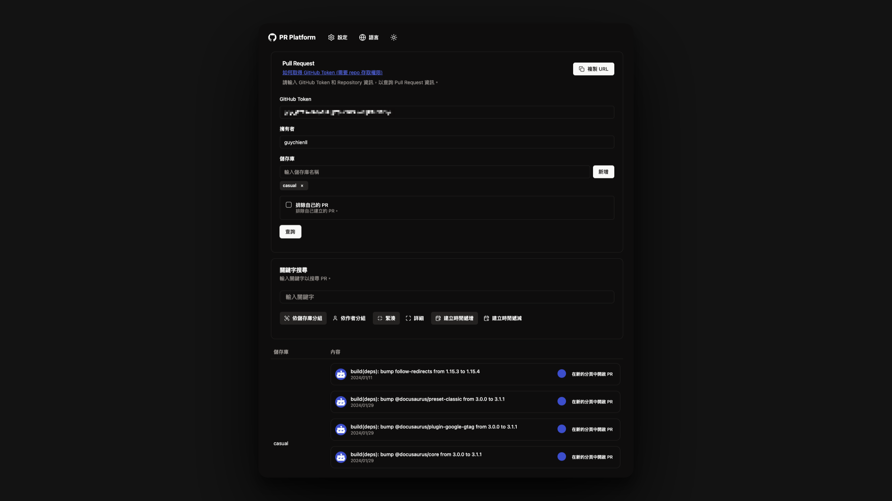

import Button from "../../src/components/Button";

# Pull Request Platform

## 介紹

PRP ( Pull Request Platform ) 是個協助團隊成員管理跨 Repository Pull Request 的工具，可以讓團隊成員在同一個平台上查看所有 Repository 的 Pull Request，並且可以快速審核 Pull Request。

<Button onClick={() => window.open("https://pr.guychienll.dev", "_blank")}> 前往 PRP </Button>

## 技術

該應用程式由開始到結束全部都在 Client 端完成，使用技術如下：

使用技術

- Next.js
- Shadcn UI
- Tailwind CSS
- TypeScript
- Vercel
- Github API

## 功能及使用方式

1. 先至 Github 申請 Personal Access Token ( 只需要有 repo `Read` 權限 )

2. 填入 Personal Access Token

3. 填上 Organization / Github Username

4. 填上 Repository 名稱

5. 點擊 `Submit` 按鈕 ( 可以決定是否要 exclude 自己開出來的 Pull Request )

